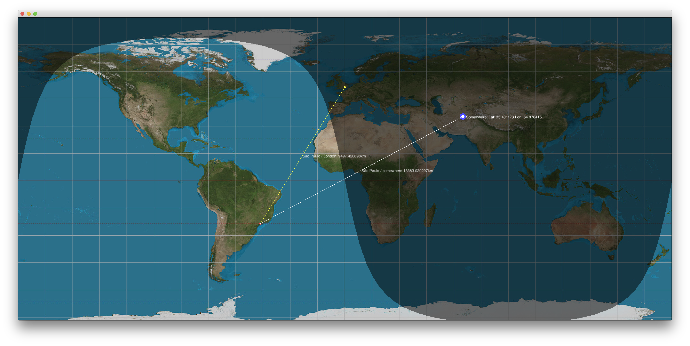

Geographic Utilities
===============


A couple of functions to help with geographic coordinates. To start you just need to set the geo::pixelSize variable, it's the size of your equiretangular map




```c++
//!Translates a Latitude and Longitude to a Cartesian point in a equiretangular map
ci::vec2 coordinateToCartesian(const Coordinate coordinate , ci::vec2 mapSize = pixelSize);

//!Translates a cartesian point to Latitude and Longitude
Coordinate cartesianToCoordinate(const ci::vec2& point, ci::vec2 size = pixelSize);

//! Returns the distance between two coordinates
double distanceCoordinate(const Coordinate& coordA, const Coordinate coordB);

//! Returns a coordinate point in the terminator line
Coordinate getTerminatorCoords(float lat, float lon, float gamma)

```
